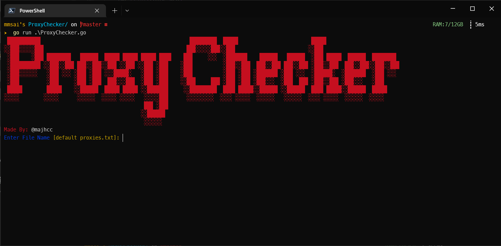

# Proxy Checker

## Get Started
- Download and install Go from the official website: https://golang.org/dl/
- Clone the repository: git clone https://github.com/majhcc/proxy-checker-go.git
- Navigate to the project directory: cd proxy-checker-go
- Build the code: go build ProxyChecker.go
- Run the executable file: ./proxy-checker.exe
## How it Works
The program will ask for the filename of your proxy list, the timeout for each request, and the target website to test the proxies against.

It will then test each proxy and display the results with a colored output and save the results to a file named `output.txt`. Proxies that successfully connect are displayed in green, while failed connections are displayed in red.

## Contribution
If you want to contribute to this project, feel free to open a pull request or issue.

## License
This tool is under MIT License.
